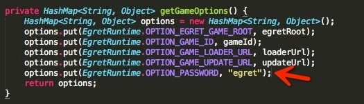

## zip 加密

相信大家对于 ```egret publish --runtime native --password your_password```这段代码中的 password 都有疑问，下面将介绍下 password 是什么并且如何使用。


### 说明
由于秘钥属于需要非常保密的，同时为了加密算法的安全性，暂时还不会提供一个完全对外的工具来让大家自己生成，如果有需要，请发邮件向我们官方同事申请 wangze@egret.com（申请时请注明开发者姓名或者公司、游戏名称、公钥钥匙串）。

在 egret 中，秘钥分为2部分，一个公钥（即申请时提供秘钥的字符串），一个私钥（通过加密算法得到的字符串）。公钥用来解密，这个会在代码或者配置文件中出现的，比如 egret。私钥是用来加密的，即命令中的 password。申请后回复的邮件中给的加密后的字符串，是一个大长串字符，比如 96da0f50a373eb5ae3dbfc059e296177，请妥善保管。

### 使用

下面讲下如何使用。

* 私钥：和说明中一样，在命令中或者 wing 工具中输入的 password。

~~~
egret publish --runtime native --password 96da0f50a373eb5ae3dbfc059e296177
~~~


* 公钥：解密钥匙串。用在 native 以及 runtime 中。

 
 android-support：
 
 
 
 ios-support：
 
 
 
 runtime：
 
 ~~~
 {
  "code_url":"http://yourhost/151127140424/game_code_151127140424.zip",
  "update_url":"http://yourhost/151127140424/",
  "password": "egret",
  "customParams":{
	"egret.runtime.debugger":"1",
	"egret.runtime.spid":"9392"
  }
}
~~~