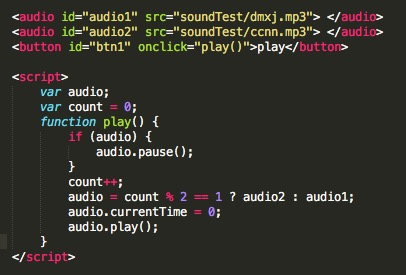
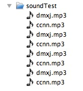
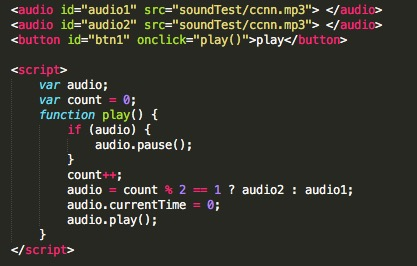
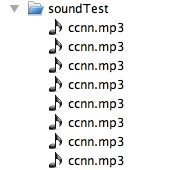
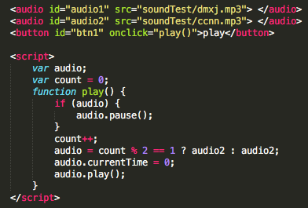

### 疑问

这里讨论的只有 audio，没有 webAudio，别问为什么(它的铺盖率还是很低很低~~~)。

说道 android h5 的音频这块，相信很多人都和小编一样，


一个听上去很简单的 DOM 组件，使用起来怎么就那么难呢！！！

在经历了一次又一次的摧残之后，相信大家都会有这样的疑问：

* 为什么声音不能播放
* 为什么声音不能循环
* 为什么声音会有延迟
* 为什么声音播放还会加载
* 为什么声音编码对了还是不行
* ......


然而翻遍了 google、bing、baidu(我相信是我的搜索关键字的问题~~~)，却没从网上找到答案，得到最多的也只是声音的编码不对、浏览器机制的问题等等看似非常有道理的答案。


### 测试
无奈一个不懂 android 底层的人，只能使用最原始的方式，手动验证大量的实验测试用例（其实一直以三星note2作为测试机型，为什么是它，因为小编的一个mp3在它的默认浏览器上没播放出声音，就是这么凑巧！），终于得出来了一个个阶段性的结果（测试浏览器主要以 自带浏览器、qq、百度、猎豹、uc、chrome、firefox）。

1、声音可以播放、循环，但是有延迟。（通过在播放前强制调用load以及设置autoplay，是的，也许你不信，但是这样确实能解决普通的mp3的播放）。

2、发现编码问题（意外发现下载的一个mp3文件不调用load、不设置autoplay竟然可以正常播放）。格式转对了，结果却还是不能播放。（难道是我的打开方式不对！！！）


3、终于找到了可以转对了的工具，可以正常播放、循环了，心情无法言表。推荐格式工厂（本想推荐更加高大上的 audition，无奈结果悲催！我的打开方式肯定是对，毋庸置疑）、44100Hz、96kbps。


然而这个状态却没持续多长，又被告知小米播放2个 audio 的时候它会去重新下载。
听到这的时候
，难道我没删除强制调用的load，

无奈检查代码，发现确实没有load，那为什么只剩play也会加载，带着疑问又得继续大量的实验测试。终于发现了几个规律（小米3默认浏览器）。

测试1：加载2个不同的声音，并交替4次播放






>确实如反馈所说，它在播放的时候下载。

测试2：加载2个相同的声音，并交替4次播放





>完全排除了同一个url的可能会不下载的情况。

测试3：加载1个声音，并点击8次重播




>也只有你是对的了。


从结果来看，默认浏览器在播放之前是没有直接加载声音的，而是在点击播放（其实只要```点击```调用load也可以）的时候才去加载，并且如果持续播放同一个audio时是不会去下载的，当然也就没有了播放延迟的问题。
而当测试猎豹、qq、百度的时候，它们的结果竟然和默认浏览器一样。

 

为了确保不是自己操作的问题，又将浏览器缓存、数据清除后来回测试了几次，结果还是一样。

 

而之后测试的uc、firefox、chrome（47.0.2526.83）给了小编一些欣慰，终于有做的基本没问题的浏览器的了。
> uc 正确，firefox、chrome 除了初始化去请求（没下载），在播放的时候才实际去下载外，其他都正确，也就是说只下载了一次。

在三星note2的测试中，还是给了小编一点安慰，它的默认浏览器竟然是对的，而qq、百度、猎豹同样沦陷。其他的手机还在持续测试中......

>从上面测试中，基本已经掌握了兼容所有的机型，你的多考虑考虑~~~


### 结论

* 浏览器播放确实和音频文件格式相关。

* 声音延迟、重复加载和各个系统或者浏览器机制息息相关。
 
* 写了 load，不代表浏览器就去加载。

* 不是所有的浏览器都能同时播放多个音频。

### 建议

* 声音想在所有的机型上播放，你得转下格式(格式工厂、44100Hz、96kbps，有可能需要再转一次)。

* 如果声音不是很重要，就合成一个文件，控制时间段播放。

* 非得加多个，最好判断下浏览器，不然你会在服务端看到一条又一条的音频文件请求。

> 各位浏览器（app）大佬们，加油，你们才是我们的曙光！！！


