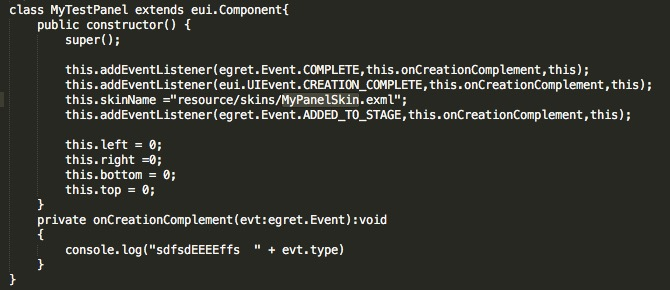
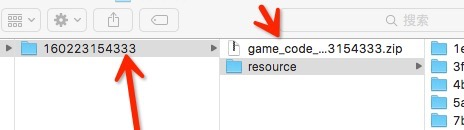
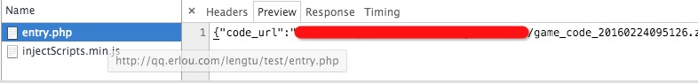
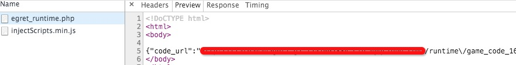

#### EUI 组件创建事件



* ```egret.Event.COMPLETE```：皮肤文件解析完后抛的事件，数据相关。如果皮肤文件已经预加载过，则在赋值 skinName 时就会抛事件，在赋值后增加监听就不会被触发；如果皮肤文件没有加载过，则会先加载，加载完后抛事件。

* ```eui.UIEvent.CREATION_COMPLETE```：MyTestPanel 组件实例化完成后抛出的事件。此事件抛出后，表示组件内部的createChildren()方法已经调用过，在该方法内初始化的相关子项都已经可以访问。

* ```egret.Event.ADDED_TO_STAGE```：MyTestPanel 的实例对象被加入到舞台后抛的事件。

> 如果需要接收 egret.Event.COMPLETE，请在赋值 skinName 前加入监听。


#### 创建 native 工程时报错系统刷新问题

* 不要在桌面创建 native 工程，需要将文件都放到同一个其他盘去，比如 e 盘。

* 创建 native 前，请确保已经执行过一次编译。


#### cacheAsBitmap 

* 当容器为空时，设置 cacheAsBitmap = true，在 runtime 下会崩溃，请规避此问题。


#### 开发平台接入相关

* 游戏在其他平台测试前，请确保已经通过审核，并且已经完成了 nest 的接入。

* nest 测试时，请使用 ```其他登录方式``` 登录，不要使用 qq 和微博登录。

#### runtime 配置相关

```
{
   //游戏代码包路径 
  "code_url":"http://your-cdn-domain/game/version_1/game_code.zip",
   //游戏资源前缀路径 
  "update_url":"http://your-cdn-domain/game/version_1/",
   //游戏代码公钥，在默认情况下请勿填写此字段  
   "password":"your-code-password",
   //游戏参数  
   "customParams": {
      //使用自定义Loading功能，在默认情况下请勿填写此字段  
      "customLoading":1 
  }  
}
```

* 默认只需要 code_url 和 update_url

* update_url 是整个资源发布的路径，不是带有 resource  的文件夹路径，另外，请加上最后的 "/"



> 比如这里的是到  160223154333 就行，不需要加入 resource

* customLoading：如果设置为1，平台的进度条就不会被删除，请在代码里自行删除，正常是不需要写这个字段

```
var json = { current : 10 ,total : 10};
var jsonStr = JSON.stringify(json);
egret.ExternalInterface.call("customLoadingFlag" ,jsonStr)
当 Runtime 收到了 current 和 total 相等的消息之后，Loading就会自动关闭。
```

* runtime 地址是指返回回来是一个纯 json 数据的地址，而不是 html 中显示的 json 格式的数据的地址

> 正确：



> 错误：



* customParams 可以方式自定义的参数（非 ```customLoading``` ），通过 egret.getOption()来获取。

```
"customParams": {
      //使用自定义Loading功能，在默认情况下请勿填写此字段  
      "key": "egret"
  }  
```

```
egret.getOption("key") //"egret"

```


